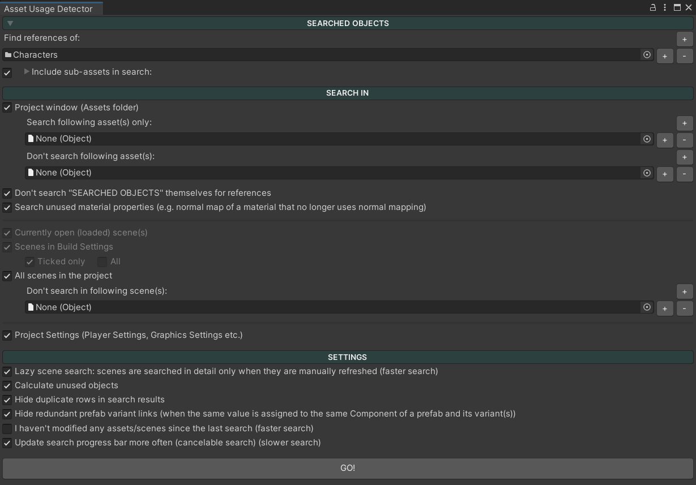
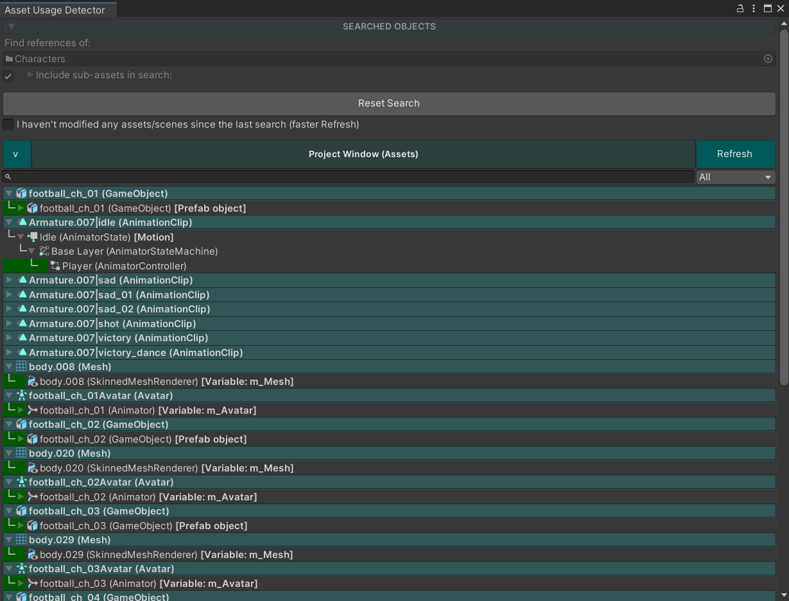
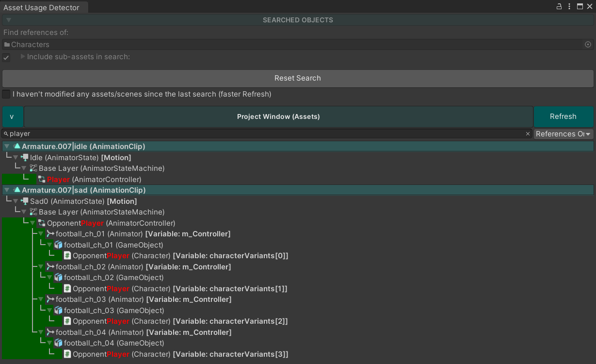

# Asset Usage Detector for Unity 3D

**Available on Asset Store:** https://assetstore.unity.com/packages/tools/utilities/asset-usage-detector-112837

**Forum Thread:** https://forum.unity.com/threads/asset-usage-detector-find-references-to-an-asset-object-open-source.408134/

**Discord:** https://discord.gg/UJJt549AaV

**[Support the Developer ☕](https://yasirkula.itch.io/unity3d)**

## ABOUT

This tool helps you find usages of the selected asset(s) and/or scene object(s), i.e. lists the objects that refer to them. It is possible to search for references in the Assets folder (Project view) and/or in the scene(s) of your project. You can also search for references while in Play mode!

## INSTALLATION

There are 5 ways to install this plugin:

- import [AssetUsageDetector.unitypackage](https://github.com/yasirkula/UnityAssetUsageDetector/releases) via *Assets-Import Package*
- clone/[download](https://github.com/yasirkula/UnityAssetUsageDetector/archive/master.zip) this repository and move the *Plugins* folder to your Unity project's *Assets* folder
- import it from [Asset Store](https://assetstore.unity.com/packages/tools/utilities/asset-usage-detector-112837)
- *(via Package Manager)* add the following line to *Packages/manifest.json*:
  - `"com.yasirkula.assetusagedetector": "https://github.com/yasirkula/UnityAssetUsageDetector.git",`
- *(via [OpenUPM](https://openupm.com))* after installing [openupm-cli](https://github.com/openupm/openupm-cli), run the following command:
  - `openupm add com.yasirkula.assetusagedetector`

## HOW TO

- Open **Window - Asset Usage Detector** window, configure the settings and hit **GO!**
  - or, right click an object and select **Search For References**
- To learn how to interpret the search results and for more instructions, please see the included [README.txt](../Plugins/AssetUsageDetector/README.txt) file
- You can tweak most settings/colors via *Project Settings/yasirkula/Asset Usage Detector* page (on older versions, this menu is located at *Preferences* window)

## KNOWN LIMITATIONS

- *Addressables* aren't supported
- *static* variables aren't searched
- *Resources.Load* usages can't be found
- *GUIText* materials aren't searched
- Textures in *Lens Flares* can't be searched
